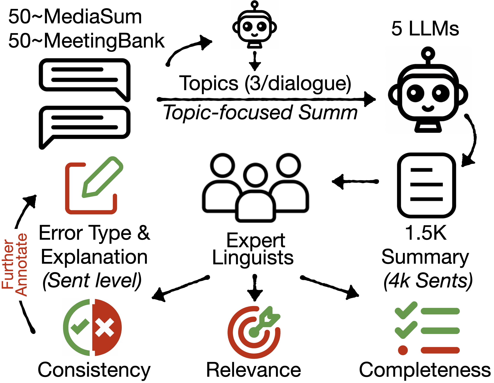

#  TofuEval: Evaluating Hallucinations of LLMs on Topic-Focused Dialogue Summarization

Authors: Liyan Tang, Igor Shalyminov, Amy Wing-mei Wong, Jon Burnsky, Jake W. Vincent, Yu'an Yang, Siffi Singh, Song Feng, Hwanjun Song, Hang Su, Lijia Sun, Yi Zhang, Saab Mansour, Kathleen McKeown

Please check out our work [here [paper link coming soon]]() 📃

This repository contains the annotations for the released benchmark dataset TofuEval. **Note that this is an evaluation benchmark. Data in the benchmark should not be used in training NLP models.**

<p align="center">
    
</p>


## Documents in TofuEval

We provide the **dev/test splits** of TofuEval and **document identifier** in `document_ids_dev_test_split.json`, which can be used to obtain the source documents from MediaSum and MeetingBank. You can extract and preprocess the source documents by your own with the following links to the original data repository.

* Documents from MediaSum can be downloaded from [here](https://github.com/zcgzcgzcg1/MediaSum)
* Documents from MeetingBank can be downloaded from [here](https://meetingbank.github.io)

Or you can use the following code snippet to extract the documents used in TofuEval:

```python
from datasets import load_dataset
import json
import pandas as pd

def obtain_dialogue_mediasum(dialogue_selected):
    dialogue_df = pd.DataFrame(columns=['doc_id', 'source'])
    for dialogue in dialogue_selected:
        dialogue_id = dialogue['id']
        speakers = dialogue['speaker']
        utts = dialogue['utt']
        transcript = ''
        for speaker, utt in zip(speakers, utts):
            transcript += f"{speaker}: {utt}\n"
        transcript = transcript.strip()
        dialogue_df.loc[len(dialogue_df)] = [dialogue_id, transcript]
    return dialogue_df

with open("document_ids_dev_test_split.json") as file:
    document_mapping = json.load(file)

meetingbank_dev_ids = document_mapping['dev']['meetingbank']
meetingbank_test_ids = document_mapping['test']['meetingbank']
mediasum_dev_ids = document_mapping['dev']['mediasum']
mediasum_test_ids = document_mapping['test']['mediasum']

meetingbank = pd.DataFrame(load_dataset("lytang/MeetingBank-transcript")['test'])
meetingbank_dev = meetingbank[meetingbank.meeting_id.isin(meetingbank_dev_ids)][['meeting_id', 'source']].reset_index(drop=True).to_csv("meetingbank_dev_doc.csv", index=False)
meetingbank_test = meetingbank[meetingbank.meeting_id.isin(meetingbank_test_ids)][['meeting_id', 'source']].reset_index(drop=True).to_csv("meetingbank_test_doc.csv", index=False)

with open("/path/to/news_dialogue.json") as file:
    news_dialogue = json.load(file)
dialogue_dev = [dialogue for dialogue in news_dialogue if dialogue['id'] in mediasum_dev_ids]
dialogue_test = [dialogue for dialogue in news_dialogue if dialogue['id'] in mediasum_test_ids]

mediasum_dev = obtain_dialogue_mediasum(dialogue_dev).to_csv("mediasum_dev_doc.csv", index=False)
mediasum_test = obtain_dialogue_mediasum(dialogue_test).to_csv("mediasum_test_doc.csv", index=False)
```
* Note: Please download `news_dialogue.json` from [MediaSum](https://github.com/zcgzcgzcg1/MediaSum) and place it in the appropriate directory before preprocessing documents.
* Please also cite MediaSum and MeetingBank if you use this benchmark.

## Factual Consistency Annotation
`factual_consistency/{dataset}_factual_eval_{split}.csv` contains factual consistency evaluations by expert linguistic annotators. The followings are descriptions of column names.

|Col. name | Description |
|--|--|
|doc_id|The document id of a source document.|
|annotation_id | The index of the source document in TofuEval. |
|topic| Topic used to generate topic-focused summaries.|
|model_name| Model used to generate the summary. Models are anynomized and the orders of models for all topics are shuffled.|
|sent_idx|The sentence index in model generated summaries. |
|summ_sent| {sent_idx}-th summary sentence by {model_name}. A full summary can be aggregated by joining these summary sentences using {sent_idx}.|
|sent_label| `yes` if the summary sentence is factual consistent, `no` otherwise.|
|exp| Human written explanation for why {summ_sent} is factually inconsistent.|
|type| Human annotated error type(s) for {summ_sent}. A sentence can have multiple error types.|

### Update: Extra Annotations

We have extended TofuEval with factual consistency annotations for one more model (`Model-Extra`). The latest version of TofuEval contains annotations for 6 models (1.8K summaries and 5K summary sentences)!

## Completeness Annotation
`completeness/{dataset}_completeness_final.csv` contains human written key points for each topic. The followings are descriptions of column names.

|Col. name | Description |
|--|--|
|doc_id|the document id of a source document.|
|annotation_id | The index of the source document in TofuEval. |
|topic| topic used to generate topic-focused summaries.|
|key_points| human written key points.|

## Topic Categorization

`topic_category/{dataset}_topic_category.json` categorizes each topic into *main* or *marginal*.

